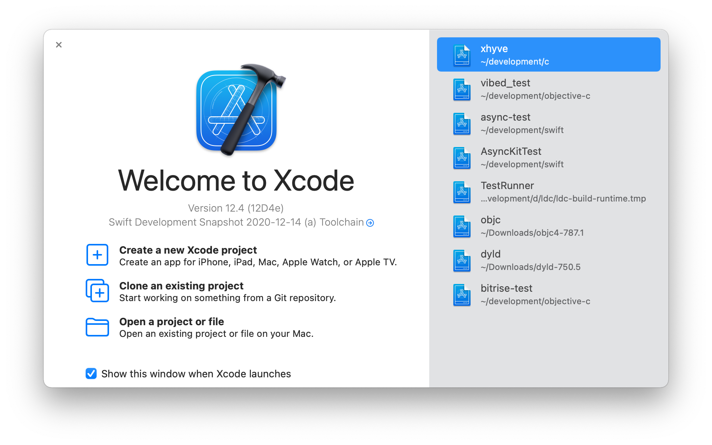
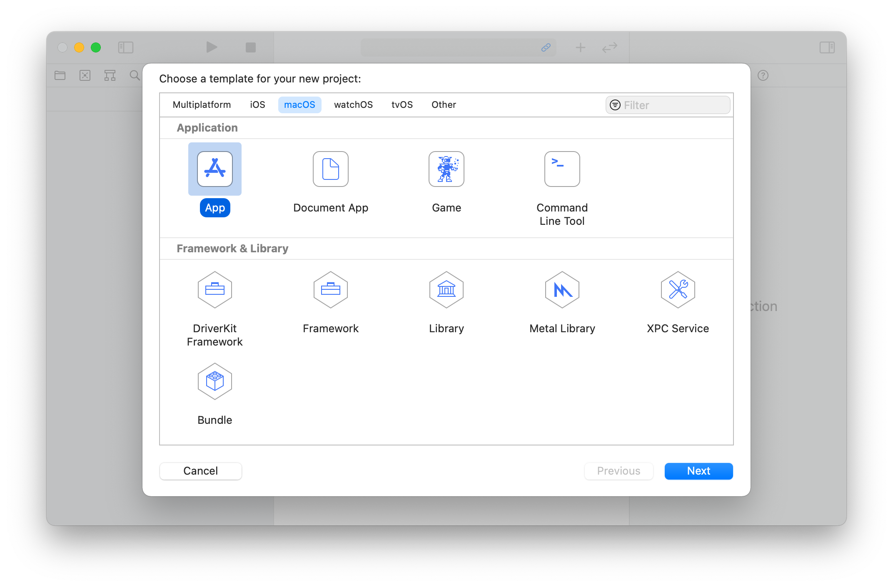
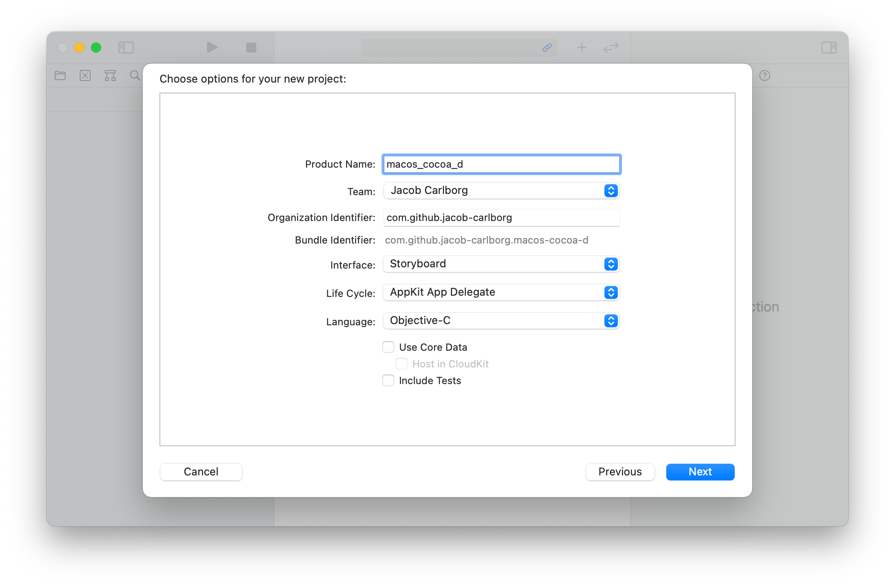
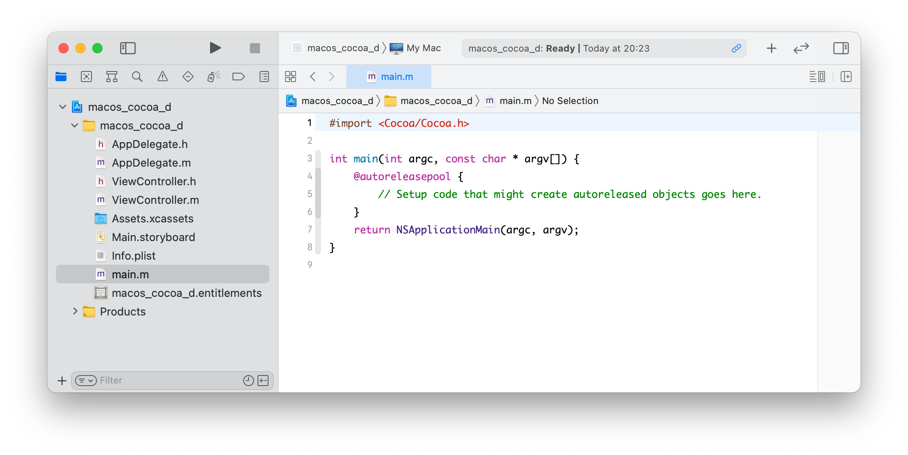
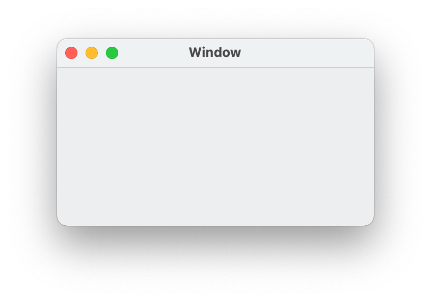

# Create a macOS Cocoa Application in Pure D

In this blog post I'm going to show how create a single macOS Cocoa application
in Pure D. The application will show a window with a text area, an input field
and a button. The button will download the HTML code for the web site and show
it in the text area.

The application will be implemented in four different ways. Code wise they will
all mostly be the same, except the last one which will be a bit differently.
The first three will differ mostly in the build process. The four ways the
application will be implemented in are:

* All code written in D with Xcode driving the build process. This will be
    the most idiomatic way when building application for macOS and will be the
    closest how you would do this in Objective-C. The graphical user interface
    (GUI) will be implemented using storyboards.

* The same as the previous way but Dub will be driving the build process. Xcode
    will only be used to create the storyboard. This is will be more like a
    native D project.

* The third way will be similar to the second way. But in this approach we'll
    try to make the project even more idiomatic for a D project.

* The fourth way will build on the third way but it will use pure code to create
    the GUI, instead of a storyboard.


## Background

### Xcode

Xcode is the IDE provided by Apple and ships with a compiler, SDK and all other
tool that are necessary to create applications for all Apple's devices.

### Storyboards

Xcode comes with a built-in feature that allows the developer to graphically
create the GUI of an application. This is called Interface Builder. The GUI is
stored in files separate from the application, basically a serialized form of
the GUI. These files are called `.nib` files and the data is stored in a binary
format. Later support was added for `.xib` files, which is the same idea but the
data stored as XML instead of binary. This is more friendly for source control.
The last incarnation of these files are storyboards. Where `.nib` and `.xib`
files contain the GUI for only a single view, storyboards can contain the GUI
for multiple views. For example, a window and the dialogs that can be opened
from that window.

The advantage of storying the GUI files separately from the application is that
if they are changed, the application does not need to be rebuilt. They also
allow to lazily load the GUI. For example, if the preferences view is stored in
a separate file and the user never opens the preferences view, then it never
needs to be loaded.

### The Cocoa Framework

As part of the SDK is the Cocoa framework. This is the framework used to create
native macOS applications with a GUI. The Cocoa framework is, what's called, an
umbrella framework. That means that it doesn't contain much code of its own but
instead depends on other frameworks for that. Cocoa consists of three frameworks:
Foundation, AppKit and CoreData.

#### Foundation Framework

The Foundation framework contains building blocks for writing Objective-C code,
functionality for dealing with strings, arrays, sockets, files, paths and so on.
It's the closets thing Objective-C has to a standard library.

#### AppKit Framework

Next is the AppKit framework. This is the framework that provides the actual GUI
components, like windows, buttons, text areas, scrollbars and so on.

#### CoreData Framework

Finally there's CoreData, which deals with object persistance and related
functionality. We will not use CoreData for this application.

### header

One problem with these frameworks, and many other of Apple's frameworks, is that
they're implemented in Objective-C. For most languages, to interface with
Objective-C, requires to use the Objective-C runtime. The Objective-C runtime
provides a C API to create classes, instantiate classes, call methods and so on.
It's quite tedious, verbose and difficult to use this API correctly. Except for
Swift, which has been created by Apple to replace Objective-C, D is the only
language which has native language support for interfacing with Objective-C.

In the latest release of D ([DMD 2.095.0](https://dlang.org/changelog/2.095.0.html)),
support for interfacing with Objective-C protocols has been added. This is the
final piece (more or less) to allow to fully interface with Objective-C code
without having to manually call the Objective-C runtime.

## First Implementation

In the first implementation of the application, Xcode will drive the build
process this will be the most idiomatic way for building applications for macOS.

### Create the Xcode Project

The first step is to create a new project in Xcode. At the Xcode launch screen,
click `Create a new Xcode project`:



Then choose the `macOS` platform and the `App` application:



For the project options, enter a `Product Name`. Select `Storyboard` in the
`Interface` dropdown. Select `Objective-C` in the `Language` dropdown and finally
click next:



Choose a directory where the project will be saved and click `Create`. After
that, Xcode will show its main window with the project. Click the play button
in the toolbar to make sure that the project compiles and runs:



The application should launch within a couple of seconds and show its main
window:



### Initialize the dub Project

[Dub](https://dub.pm/getting_started) will be used to build the D source code
and Xcode will link the binary and do all the other things that is part of
building a macOS application.

The first step is to initialize a Dub project within the Xcode project. Open
the Terminal, navigate to the directory where the Xcode project was saved.
Execute the following command to initialize a Dub project using the SDLang
format for the package description file:

```
dub init -f sdl -n .
```

Open the `dub.sdl` file that was created in the current directory when
initializing the Dub project. Specify that Dub should build the project as a
library by adding the following line:

```sdl
targetType "library"
```

### Replace Objective-C with D

Now it's time to replace the existing Objective-C with pure D code. If we take
a look at the existing Objective-C files and headers, we can see that the code
depends, either directly or indirectly, on the following framework types:

* `NSViewController`
* `NSResponder`
* `NSObject`
* `NSApplicationDelegate`
* `NSNotification`

To use these types from D, bindings need to be created for the types and the
methods the application is going to use. Since `NSObject` is the root class
of all classes in Objective-C, it's a good place to start:

#### `NSObject`

The NSObject type is a bit special, because there's both a class that is named
`NSObject` and a protocol (which corresponds to an interface in D) with the
same name. In Objective-C classes and protocols live in different namespaces
and therefore can share the same name.

In D, classes and interfaces live in the same namespace so it's not possible to
have a class and an interface with the same name in D. Fortunately, for our
application, it's enough to use the `NSObject` class and declare any methods
defined in the `NSObject` protocol on the class instead.

The documentation of the `NSObject` class is available
[here](https://developer.apple.com/documentation/objectivec/nsobject?language=objc)
and the protocol is available
[here](https://developer.apple.com/documentation/objectivec/1418956-nsobject?language=objc).
The header file for the `NSObject` class and protocol is available in the SDK
which is installed along with Xcode. The path to the header file is:

```bash
SDK_ROOT="$(xcrun --show-sdk-path)"
"$SDK_ROOT/usr/include/objc/NSObject.h"
```

For this application the following methods will be used: `alloc`, `init`,
`retain` and `release`. The relevant part of the declaration of the `NSObject`
class in Objective-C looks like this (some macros an Swift specific code has
been removed):

```objective-c
@interface NSObject <NSObject>
  - (instancetype)init
  + (instancetype)alloc
@end
```

In Objective-C the `@interface` keyword is used to declare a class. Within
angle brackets (`<NSObject>`) are the protocols this class implements listed.

Between the `@interface` and `@end` keywords are the methods declared. A method
prefixed with a dash (`-`) declares an instance method. While a methods prefixed
with a plus sign (`+`) declares a class method (static method).

Within parentheses, `(instancetype)`, is the return type declared.
`instancetype` is a unique Objective-C feature that does not have any
corresponding feature in D. It basically means the type of an instance of this
class. In the `NSObject` class the type will be `NSObject`. In a subclass it
will be the type of the subclass.

After the return type comes the method name or the selector, `init` and `alloc`
in this case.

The relevant parts of the `NSObject` protocol declaration look like this:

```objective-c
@protocol NSObject
  - (instancetype)retain;
  - (oneway void)release;
@end
```

A protocol is declared with the `@protocol` keyword. Otherwise the same syntax
as for classes is used.

When writing bindings to the above Objective-C code in D, it would look like this:

```d
module objc.nsobject;

import core.attribute : selector;

extern (Objective-C):
extern:

class NSObject
{
    NSObject init() @selector("init");
    static NSObject alloc() @selector("alloc");

    NSObject retain() @selector("retain");
    void release() @selector("release");
}
```

It's more or less the same syntax as for a regular D class.
[`extern (Objective-C)`](https://dlang.org/spec/attribute.html#linkage) is used
to specify this is an Objective-C class. `extern` is used to specify this is an
externally defined class. Just as any static/class method in D, the `static`
keyword is used. Instead of the `instancetype` in the Objective-C code, the
return type is hardcoded to match the class. In theory, `typeof(this)` could be
used to more closely match the Objective-C code, but the type would not
propagate to subclasses and it would be `NSObject` even in the subclasses.

[`@selector`](https://dlang.org/phobos/core_attribute.html#.selector) is a
compiler recognized user-defined attribute. It's used to specify the selector
of the Objective-C method. A selector must be present for all Objective-C
methods.

#### `NSViewController`

From `NSViewController`, we need the following methods for this application:
`viewDidLoad` and `setRepresentedObject`. The relevant Objective-C code looks
like this:

```objective-c
@interface NSViewController : NSResponder
@property (nullable, strong) id representedObject;
- (void)viewDidLoad;
@end
```

The documentation is available [here](https://developer.apple.com/documentation/appkit/nsviewcontroller?language=objc).
The header file is available at this path:

```bash
"$SDK_ROOT/System/Library/Frameworks/AppKit.framework/Headers/NSViewController.h"
```

In Objective-C the `@property` keyword is used to declare a property.
Properties work more or less the same as in D, but they have a more strict
syntax in Objective-C. That is, not all methods can be called with the property
syntax. Inside parentheses, `nullable` means the value can be `null` and
`strong` means it's a retained strong reference. The `id` type is a type that
can hold any Objective-C class or protocol.

The Objective-C integration in D currently doesn't support properties, but
Objective-C properties can be called like a regular method. We can take
advantage of that and emulate properties in the bindings. The `NSViewController`
class would look like this in D:

```d
import core.attribute : selector;
import appkit.nsresponder;

extern (Objective-C):
extern:

class NSViewController : NSResponder
{
    NSObject representedObject() @selector("representedObject");
    void representedObject(NSObject representedObject) @selector("setRepresentedObject:");

    void viewDidLoad() @selector("viewDidLoad");
}
```

In D, `NSObject` can be used instead of `id` to hold any classes. To emulate
properties, overloading can be used to declare the `representedObject` method
twice, with different signatures and different selectors. The first declaration
will be the getter and the second will be the setter. With the help of D's
support for calling any method with property syntax we have managed to emulate
Objective-C properties in the bindings layer.
